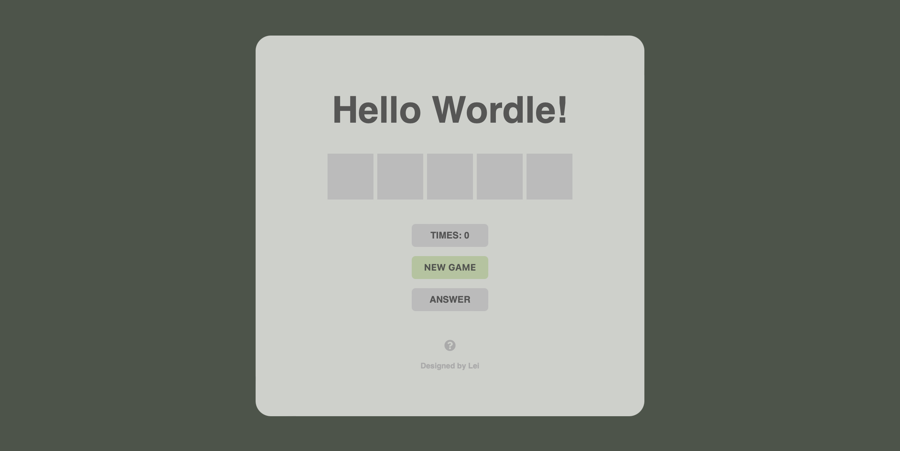

# React Wordle App

Try to guess a five-letter word and find the final answer.

Enter or delete letters until you have five, then press Enter to check your attempt.

Result of attempts:
- Gray means the letter is not in the final answer.
- Green means the letter is in the correct position.
- Orange means the letter is in the word but not in the correct position.

Guide:
- "TIMES" displays the number of attempts you've made.
- "NEW GAME" starts a new round.
- "ANSWER" reveals the correct word.

Page: https://r09521516.github.io/wordle/

# Built with

- HTML + CSS + JavaScript
- React

# React + Vite

This template provides a minimal setup to get React working in Vite with HMR and some ESLint rules.

Currently, two official plugins are available:

- [@vitejs/plugin-react](https://github.com/vitejs/vite-plugin-react/blob/main/packages/plugin-react/README.md) uses [Babel](https://babeljs.io/) for Fast Refresh
- [@vitejs/plugin-react-swc](https://github.com/vitejs/vite-plugin-react-swc) uses [SWC](https://swc.rs/) for Fast Refresh

# Contact

- Email: leihsu97@gmail.com
- Project link: https://github.com/r09521516/wordle

# Acknowledgments

- [Font Awesome](https://fontawesome.com/start)
